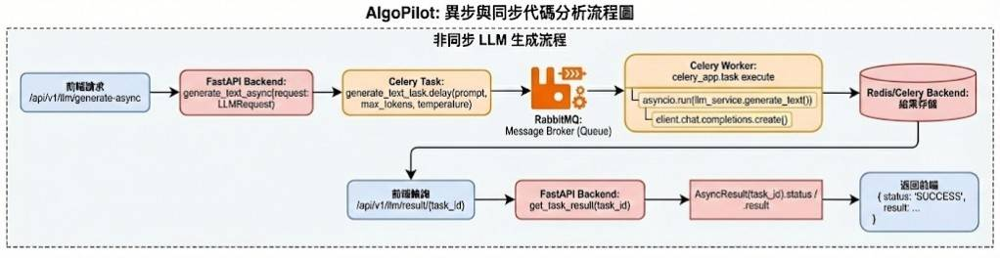
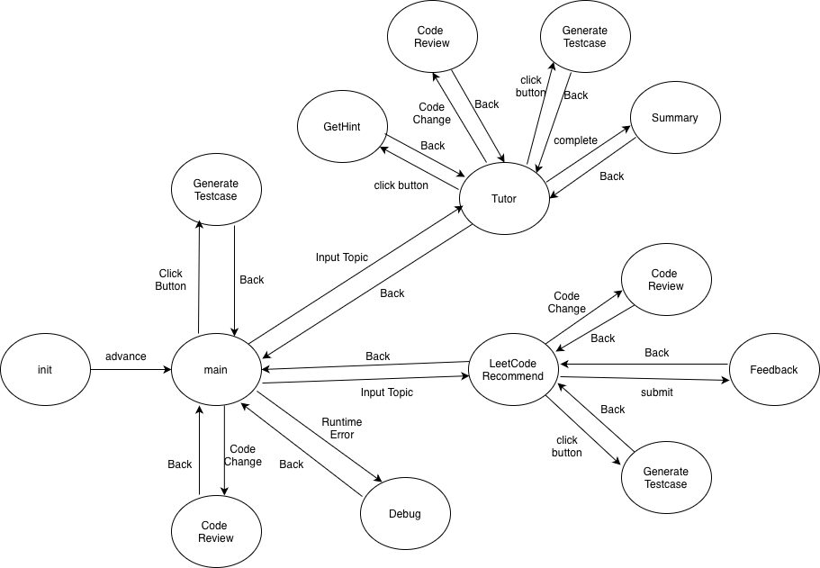

# AlgoPilot

AlgoPilot is an AI-powered VS Code Extension designed to assist developers, especially those in algorithm competitions or working on performance-critical code. It acts as an intelligent coach, providing proactive feedback on code quality, efficiency, and safety.

## Setup

The AlgoPilot extension should work out-of-the-box. Ensure your internet connection is active as it relies on an external LLM service.

## Implemented Features

### 1. AI-powered Algorithm Code Review (Auto Review)

AlgoPilot actively reviews your code in the background, providing real-time feedback directly in the VS Code editor. It focuses on common pitfalls and best practices in algorithm design and competitive programming.

*   **Multi-language Support**: Supports a wide range of popular programming languages including:
    *   TypeScript, JavaScript
    *   Python
    *   C++, C
    *   Java
    *   Go
    *   Rust
*   **Intelligent Detection Capabilities**:
    *   **Time Complexity (TLE Risk)**: Identifies loops or recursive patterns that might lead to Time Limit Exceeded (TLE) errors for large inputs (e.g., O(N^2) solutions when an O(N) or O(N log N) solution is expected).
    *   **Data Type Safety (Overflows)**: Checks for potential integer overflows, warning when a variable (e.g., `int`) might not be sufficient to hold computed values, and suggests using larger data types (e.g., `long long` in C++, `BigInt` in JavaScript).
    *   **Corner Cases & Edge Conditions**: Flags missing or inadequate handling of edge cases such such as empty arrays, `n=0`, `n=1`, or other boundary conditions that often cause "Wrong Answer" (WA).
    *   **Memory Safety (C/C++ specific)**: Provides warnings for potential memory leaks, out-of-bounds access, or invalid pointer usage in C/C++ code.
*   **Proactive Feedback**: Diagnostics (squiggly lines and warning messages) appear automatically in your editor upon saving the document, guiding you to write more robust and efficient code.

### 2. Smart Edge Case Generation

AlgoPilot helps you test your code more rigorously by automatically generating edge cases that you might have missed.

*   **One-Click Generation**: Simply click the **"⚡ Generate Edge Cases"** CodeLens that appears above your function definitions.
*   **Intelligent Analysis**: The AI analyzes the function's logic and input types to determine the most critical boundary conditions (e.g., `INT_MAX`, empty arrays, `null` inputs).
*   **Inline Results**: The generated test cases are inserted directly into your code as comments, making it easy to reference them while writing tests or debugging.

### 3. Intelligent Debugging Assistant (Crash Analyzer)

When debugging your code in VS Code, AlgoPilot acts as a smart companion that helps you understand why your program crashed.

*   **Automatic Crash Detection**: The extension listens for "Exception" events during a debug session.
*   **Root Cause Analysis**: It captures the stack trace, local variable values, and relevant source code, then uses AI to explain the exact reason for the crash.
*   **Minimal Reproduction**: It suggests a minimal test case or input that would reproduce the crash, helping you isolate the bug faster.

### 4. Vibe Coding Tutor

Learn to code by doing, with an AI tutor that guides you step-by-step.

*   **Goal Decomposition**: Tell the tutor what you want to build (e.g., "A binary search tree"), and it breaks it down into manageable sub-tasks.
*   **Interactive Guidance**: Get hints and code snippets for each step without being spoon-fed the entire solution.
*   **Gamified Progress**: Track your progress through the lesson plan and celebrate completion.

## System Design Diagram

  

## User Flow Diagram

  

## Future Ideas & Roadmap

*   **Team Collaboration Tools**:
    *   **Code Documentation Generator**: Automatically create plain-language documentation (e.g., in `.h` files or comments) for functions and classes, aiding understanding of unfamiliar codebases.
    *   **Environment Configuration Checker**: Automatically detect dependency changes when switching Git branches and notify developers, ensuring synchronized development environments.
*   **Interactive Code Sandbox**: Allow users to highlight a function or class and instantly execute it in an isolated environment with auto-generated mock data, enabling real-time experimentation without affecting the main project.
*   **Git Diff Analysis**: Analyze code changes between Git commits and provide plain-language explanations of their impact and purpose.